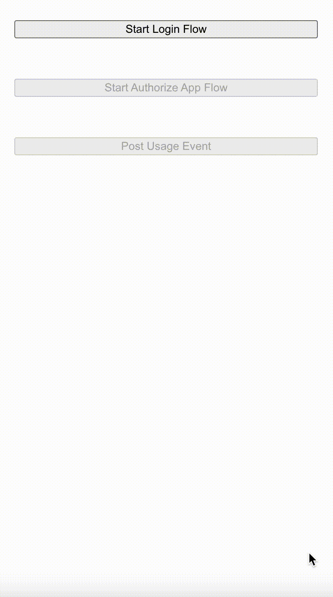

# minipay-react

>

[](https://www.npmjs.com/package/minipay-react) [](https://standardjs.com)

## Installation

```bash
npm install --save minipay-react
```

## Demo



## Test Mode

In order to test your integration, Minipay provides a completely separate testing mode. This is a testing environment that simulates creating real objects without the risk of affecting real transactions or moving actual money.

Test mode accounts are entirely separate from production accounts, so you'll need to create a test account the same way you created a production account. We recommend using test mode to build the integration and replace your test keys with live keys when you’re ready to go live.

## Quick Start Guide

### 1. Initial setup

Sign up for Minipay and register a new Merchant account. Make sure to create your new project.

### 2. Store your secrets

You can find your secret API key and project identifier on the Settings page in the Minipay dashboard.

### 3. Connect your bank

Connect us with your bank in order to receive payments from your subscribers. You can link it on the Settings page in the Minipay dashboard.

### 4. Create a plan

Create a plan to offer to subscribers on the Plans page in the Minipay dashboard.

### 5. Connect with your first subscriber

Now that your account is all setup, we can start handling your subscribers. When your customer is ready to link your service with Minipay, request that they log in to their Minipay account. We'll be using their authorization token that comes back in the response to map their Minipay account to a custom user identifier that you provide. This way they only have to log into Minipay once.

```jsx
import React, { Component } from 'react'
import { MinipayLogin } from 'minipay-react'

class ExampleLogin extends Component {
    render() {
        return (
            <MinipayLogin
                testModeEnabled={true} // Or false (for production environment)
                onSuccess={(data) => {
                    // Save this token to state
                    console.log(data.token)
                }}
                onFailure={(error) => {
                    console.log(error)
                }}
            />
        )
    }
}
```

### 6. Authorize your app on their account

With the authorization token that you just received, add your app to the list of their authorized apps.

Provide a custom user identifier in this request. It will allow Minipay to map future events to this subscriber's account without requiring a login each time. The plan identifier should match the plan that we created in an earlier step.

```jsx
import React, { Component } from 'react'
import { MinipayAuthorizeApp } from 'minipay-react'

class ExampleAppAuthorization extends Component {
    render() {
        return (
            <MinipayAuthorizeApp
                customUserId='<your-custom-user-id>'
                planId='<your-plan-id>'
                minipayToken='<token-from-state>'
                testModeEnabled={true} // Or false (for production environment)
                onSuccess={(data) => {
                    // Whether or not the app auth was successful
                    console.log(data.response.successful)
                }}
                onFailure={(error) => {
                    console.log(error)
                }}
            />
        )
    }
}
```

### 7. Post a usage event

Now, whenever you want to record a usage event from this subscriber, simply post a request to the Minipay service that includes their custom user identifier and plan identifier that they're subscribed to. We'll handle the rest.

```jsx
import React, { Component } from 'react'
import { MinipayPostUsageEvent } from 'minipay-react'

class ExamplePostUsageEvent extends Component {
    render() {
        return (
            <MinipayPostUsageEvent
                customUserId='<your-custom-user-id>'
                planId='<your-plan-id>'
                apiKey='<your-api-key>'
                testModeEnabled={true} // Or false (for production environment)
                onSuccess={(data) => {
                    // Whether to allow or reject access to your services
                    console.log(data.response.authorized)
                }}
                onFailure={(error) => {
                    console.log(error)
                }}
            />
        )
    }
}
```

When Minipay records a usage event, it will attempt to charge the subscriber's account. The response will indicate whether or not the authorization was successful. In the successful case, you should allow the subscriber's access to your services. In the failure case, you should prevent their access.

Please consult our [docs](https://minipayhq.com/docs) for more information.

## License

The minipay-react package is available under the MIT license. See the LICENSE file for more info.
